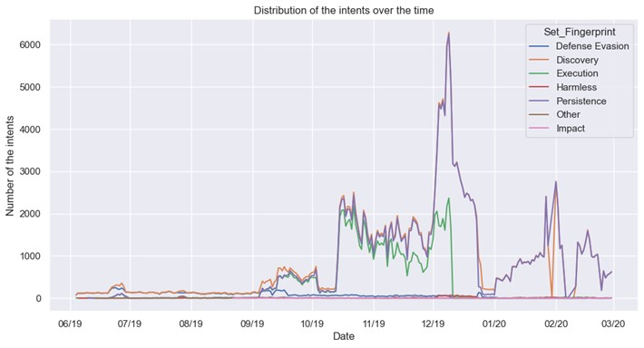

# SSH Attack Detection Using Machine Learning
- This README provides a comprehensive overview of the SSH Attack Detection project using machine learning techniques. For a more detailed explanation of the project, including data analysis, methodologies, and in-depth results, please refer to the `SSH_ATTACKS_FINAL_VERSION.pdf` file located in the project directory.

- The PDF contains all the technical details, charts, and metrics that were part of this project. It is recommended to review the document for a deeper understanding of the results and the reasoning behind our machine learning models.
- 

## Overview

This project investigates the use of machine learning algorithms to detect and classify SSH shell attacks. It is inspired by the growing importance of network security, particularly in detecting malicious attempts on SSH servers. By leveraging both supervised and unsupervised learning models, this project aims to identify attack patterns and enhance the ability to predict future attacks with greater accuracy.

The dataset used consists of over 233,000 rows, each representing a session with a set of commands executed by attackers on a honeypot environment. This project focuses on transforming raw session data into meaningful insights through various machine learning techniques.

## Authors
- Lorenzo Ferretti (s331942)
- Alessio Mantineo (s324267)
- Carmen Moncada (s296675)
- Riccardo Tommasi (s323816)

## Table of Contents
1. [Introduction](#introduction)
2. [Dataset and Pre-Processing](#dataset-and-pre-processing)
    - [Data Exploration](#data-exploration)
    - [Pre-Processing: Improving Data Quality](#pre-processing-improving-data-quality)
    - [Transformation Techniques](#transformation-techniques)
    - [Data Sampling](#data-sampling)
    - [Standardization of Multi-Label Categories](#standardization-of-multi-label-categories)
3. [Supervised Learning Models](#supervised-learning-models)
    - [Random Forest](#random-forest)
    - [K-Nearest Neighbors](#k-nearest-neighbors)
4. [Unsupervised Learning Models](#unsupervised-learning-models)
    - [K-Means](#k-means)
    - [Gaussian Mixture Model (GMM)](#gaussian-mixture-model-gmm)
5. [Language Models and Neural Networks](#language-models-and-neural-networks)
    - [Doc2Vec and Neural Network Model](#doc2vec-and-neural-network-model)
6. [Results and Analysis](#results-and-analysis)
    - [Hyper-Parameter Tuning](#hyper-parameter-tuning)
    - [Clustering Analysis](#clustering-analysis)
    - [Final Considerations](#final-considerations)
7. [Conclusion](#conclusion)

---
## Introduction

SSH is a critical protocol used to access servers remotely. Due to its importance, it is a common target for attackers. This project is focused on detecting attacks in real-time using machine learning models. The goal is to improve the identification of malicious activity using advanced algorithms that can learn and adapt from historical data.

Machine learning techniques offer promising solutions to quickly analyze and detect abnormal patterns that might otherwise go unnoticed by human analysts. The dataset used for this project captures command sequences executed by attackers on a honeypot and provides a unique opportunity to apply machine learning to cybersecurity.

---

## Dataset and Pre-Processing

### Data Exploration

The dataset contains more than 230,000 rows, with each row representing a complete SSH session. Attack sessions contain a sequence of commands executed by an attacker. For the purpose of this analysis, benign sessions were filtered out, and only attack-related sessions were retained. 

Key observations:
- The frequency of attacks varies over time, with notable peaks during certain periods, especially around the end of 2019 and early 2020. This indicates specific patterns of attack that may correspond to real-world scenarios where companies have reduced activity or fewer monitoring personnel.
- Most attacks fall into categories such as "Discovery," "Persistence," and "Execution," with "Defense Evasion" and other intents being less frequent.

### Pre-Processing: Improving Data Quality

The raw dataset consists of sessions with commands that are often encoded (e.g., base64 encoding). We applied decoding techniques to make these commands readable and actionable for the analysis. 

Key Steps:
- A base64 decoding function was applied to remove obfuscation from commands, particularly to detect malicious activities more effectively.
- Command sequences were split and processed into structured formats, using techniques like Term Frequency-Inverse Document Frequency (TF-IDF) to transform raw text into numerical features.
- Data was cleaned to remove irrelevant information, including temporary files and unrelated command sequences.

### Transformation Techniques

To convert the text data into a usable format for machine learning models, we used TF-IDF to generate new feature vectors based on the frequency of commands in each session. This allowed us to create a structured dataset that can be easily processed by classification and clustering algorithms.

### Data Sampling

Given the large size of the dataset, a sampling technique was employed to reduce the computational load. We reduced the dataset to approximately 5,853 samples while ensuring that the dataset remained representative of the full set of attack categories.

### Standardization of Multi-Label Categories

The MultiLabelBinarizer technique was used to handle multi-label classification, where each session could belong to multiple attack categories. This transformation was crucial for applying supervised learning algorithms effectively.

---

## Supervised Learning Models

### Random Forest

Random Forest is an ensemble classifier that uses multiple decision trees to make predictions. In this project, it was used to classify attack sessions based on the transformed features.

Key Metrics:
- High accuracy (~98%) on both training and test sets.
- Precision, recall, and F1-scores were high for categories like "Discovery" and "Execution," but performance was lower for less common categories like "Harmless" and "Impact."
- Overfitting was detected in some categories, particularly for those with lower support.

### K-Nearest Neighbors (K-NN)

The K-NN algorithm classifies a session by finding the most common labels among its nearest neighbors in the dataset. This model performed comparably to Random Forest, with similar levels of accuracy but more balanced performance across smaller classes.

Key Metrics:
- K-NN demonstrated better macro-average F1-scores for smaller classes like "Impact" and "Other."
- Overfitting was still present, but to a lesser degree compared to Random Forest.

---

## Unsupervised Learning Models

### K-Means

K-Means clustering was applied to group sessions into clusters based on their command sequences. By tuning the number of clusters, we were able to analyze the natural grouping of attack types.

### Gaussian Mixture Model (GMM)

The GMM algorithm was also applied for clustering, allowing for more flexibility by modeling clusters as Gaussian distributions. Both clustering models revealed meaningful patterns in the dataset, particularly in distinguishing between different types of attacks.

---

## Language Models and Neural Networks

### Doc2Vec and Neural Network Model

The Doc2Vec model was used to represent the text data as vectors, which were then fed into a neural network built using Keras. This model aimed to capture deeper relationships between command sequences that were not evident from traditional methods.

Key Steps:
- The neural network model was trained on the vectorized data using various hyperparameter combinations, including different vector sizes (100, 300, and 800) and learning rates.
- Experiments showed that larger vector sizes led to better performance but required more computational resources.

---

## Results and Analysis

### Hyper-Parameter Tuning

Both supervised models underwent hyper-parameter tuning using GridSearch to find the best combination of settings. Random Forest achieved its best performance with 30 estimators and a maximum depth of 10, resulting in a weighted F1-score of 99.2%.

### Clustering Analysis

The clusters generated by K-Means and GMM revealed interesting patterns in the data, such as the concentration of "Persistence" and "Discovery" attacks towards the end of 2019. These insights could potentially help predict when similar attacks might occur in the future.

### Final Considerations

The results indicate that machine learning models can be highly effective in identifying attack patterns within SSH session data. While Random Forest and K-NN models performed well, further improvements could be achieved by addressing the class imbalance, especially for less frequent attack categories.

---

## Conclusion

This project demonstrates the feasibility of using machine learning models for detecting SSH attacks. Through supervised classification and unsupervised clustering, we were able to accurately predict attack types and identify patterns in large datasets. Future work could focus on refining the models to handle less common attack types more effectively and applying these techniques in real-time detection systems.
